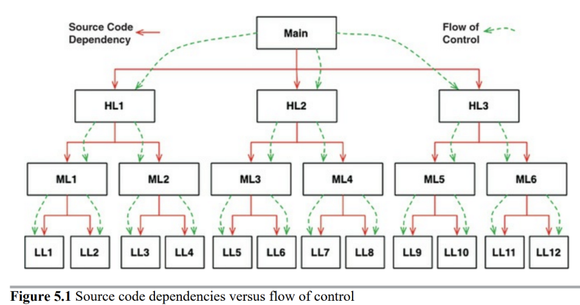
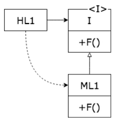
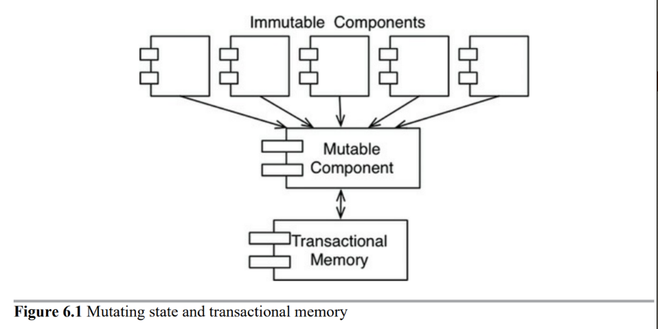

# 2부. 벽돌부터 시작하기: 프로그래밍 패러다임

> 프로그래밍 패러다임이란? 프로그래밍을 하는 방법. 패러다임은 어떤 프로그래밍 구조를 사용할지, 언제 이 구조를 사용해야 하는지를 결정.

프로그래밍 패러다임에 대해 알아보자. 세 가지 패러다임이 있다.

→ 1958~1968년 사이에 이 세 가지 패러다임이 만들어졌고 그 이후 새로운 패러다임은 지금까지 없다.

각각의 패러다임을 통해 아키텍처에 어떤 식으로 적용할 수 있을지 생각해보자.

## 1. 구조적 프로그래밍

- 1968년 다익스트라가 발견
- 간단하게 말하면 <u>**무분별한 점프(goto)를 사용하지 말고, 순차/분기/반복만 사용하자. (if..while..)**</u>
  - 즉 대다수의 현재 언어는 goto 문을 포함하지 않기 때문에 현재의 우리는 모두 구조적 프로그래머임

### 왜?

> 왜 무분별한 goto를 사용하지 말자고 했을까?

- 다익스트라가 생각한 문제 → 프로그램은 인간의 머리로 이해하기 어렵다. 너무 많은 세부사항이 있어서 그 세부사항을 모두 기억하고 있기란 불가능하다. 그러면 간과한 세부사항으로 인해 프로그램이 예상 외의 방식으로 실패하곤 한다.
- 그래서 다익스트라는 증명이라는 수학적인 원리를 통해 이 문제를 해결하려고 생각했다.

### 증명은 어떻게 할까?

- 유클리드 계층구조는 공리(증명 없이 참으로 받아들이는 명제)로부터 시작해서 어떤 명제를 증명하여 정리(theorem)를 만들어낸다.
- 그럼 프로그래머도 공리처럼 어떤 입증된 구조로부터 시작해서 그 구조를 코드와 결합시키면, 수학에서 명제를 참으로 증명하는 것처럼 프로그램의 코드도 올바르다는걸 증명할 수 있지 않을까?
- 이를 위해 연구하던 중, 다익스트라는 무분별한 goto문이 증명에 방해가 된다는 걸 발견했다. 그리고 if/then/else와 do/while과 같이 분기와 반복이라는 단순한 제어구조만을 사용해야 모듈을 증명 가능한 단위까지 분해하는 것이 가능하다고 생각했다.
  - 그리고 모든 프로그램은 순차/분기/반복의 세 가지 제어구조만으로 작성할 수 있다는 사실이 이미 증명되어 있었다.

### 구조적 프로그래밍을 통한 기능적 분해

- 구조적 프로그래밍을 통해 모듈을 증명 가능한 단위까지 재귀적으로 분해할 수 있게 되었다.
  - 즉, 어떤 거대한 요구사항 → 고수준의 기능 → 이를 또 저수준의 함수로 나누고 → 또 나누고..
  - 이런 분해 과정이 가능해짐. 그리고 이렇게 분해한 기능은 구조적 프로그래밍의 제어 구조만으로 표현 가능

### 증명은 이루어지지 않았다.

하지만 증명은 이루어지지 않았다. 프로그램 관점에서 유클리드 계층구조는 만들어지지 않았다. 그리고 프로그래머들은 이렇게 세세한 기능을 증명하는 이득이 없다고 생각했다.

하지만? 수학적인 증명이 이루어지지 않았을 뿐, <u>**과학적 방법(scientific method)**</u>은 성공했다.

### 과학적 방법

과학은 틀렸음을 증명하는 방식으로 동작하고, 도저히 반례를 들 수 없는 서술이 있다면 목표에 부합할 만큼 참이라고 본다.

과학적 방법은 경험에 따른 귀납적 결론을 만들어낸다. 따라서 과학적 방법에 의한 지식은 언제나 잘못됐을 수 있다. 즉, 수학과 달리 과학 이론과 법칙은 완전히 참인 걸 절대 증명할 수 없다. 

- 수학: ‘참’임을 입증
- 과학: ‘거짓’임을 입증

### 그래서… 중요한건 테스트

> “테스트는 버그가 있음을 보여줄 뿐, 버그가 없음을 보여줄 수는 없다.” - 다익스트라

테스트가 모두 통과한다고 해서 프로그램이 맞다고 증명할 순 없다. 테스트가 실패한다면 틀렸다는 것은 알 수 있다.(과학처럼!) 그리고 테스트가 보장해줄 수 있는 건 프로그램이 목표에 부함할 만큼은 참이라고 여길 수 있게 해주는 것이 전부다.

그리고 이런 테스트를 위해선 증명이 가능한 단위로 프로그램을 나눌 수 있어야 한다. → 구조적 프로그래밍!

### 결론

구조적 프로그래밍의 가치는 이렇게 반증 가능한 단위를 만들어낼 수 있기 때문.

소프트웨어 아키텍트는 모듈, 컴포넌트, 서비스가 쉽게 반증 가능하도록 만들기 위해 노력해야 한다.

- 쉽게 반증 가능하도록? 즉 테스트하기 쉽도록

## 2. 객체 지향 프로그래밍

좋은 아키텍처를 만드는 길은 객체 지향 설계 원칙을 이해하고 응용하는 데서 출발한다.

그럼 도대체 객체 지향이란 무엇인가?

1. 데이터와 함수의 조합이다? → 이미 그 전부터 프로그램은 데이터와 함수의 조합이었음
2. 실제 세계를 모델링하는 방법이다? → 실제 세계를 모델링한다는 게 정확히 뭔데? 그리고 왜 모델링해야 하는데?
3. <u>**캡슐화, 상속, 다형성의 조합**</u>이다. 혹은 이 세 가지 요소를 반드시 지원해야 한다. → 그런가? 살펴보자

### 캡슐화?

- OO 언어는 데이터와 함수를 캡슐화하는 방법을 제공. 이를 통해 데이터와 함수가 응집력 있게 구성된 집단을 구분 지을 수 있음. 

- 하지만?

  - OO가 아닌 언어에서도 캡슐화 가능.

  - C언어 - 헤더파일과 소스파일을 나눠서 헤더 파일을 사용하는 측에선 구현에 대해서 알지 못한다.

    - `point.h`

      ```c
      struct Point;
      struct Point* makePoint(double x, double y);
      double distance (struct Point *p1, struct Point *p2)
      ```

    - `point.c`

      ```c
      #include "point.h"
      #include <stdlib.h>
      #include <math.h>
      
      struct Point {
      	double x,y;
      };
      
      struct Point *makePoint(double x, double y) {
      	struct Point* p = malloc(sizeof(struct Point));
       	p->x = x;
        p->y = y;
        return p;
      }
      
      double distance(struct Point* p1, struct Point* p2) {
      	double dx = p1->x - p2->x;
        double dy = p1->y - p2->y;
        return sqrt(dx*dx+dy*dy);
      }
      ```

  - C++로 객체지향이 등장했다. → 하지만 오히려 C가 제공하던 캡슐화가 깨졌다

    - C++은 헤더파일에 클래스의 멤버 변수를 선언해야 한다. 그럼 해당 헤더파일 사용자는 멤버 변수가 존재한다는 사실을 알게 된다. 만약 멤버 변수 이름이 바뀐다면? 다시 컴파일해야 한다. → 캡슐화가 깨졌다.

    - `point.h`

      ```cpp
      class Point {
      public:
      	Point(double x, double y);
        double distance(const Point& p) const;
         
      private:
      	double x;
        double y;
      };
      ```

    - `point.cc`

      ```cpp
      #include "point.h"
      #include <math.h>
      
      Point::Point(double x, double y)
      : x(x), y(y)
      {}
      
      double Point::distance(const Point& p) coonst {
      	double dx = x-p.x;
        double dy = y-p.y;
        return sqrt(dx*dx + dy*dy);
      }
      ```

  - 심지어 자바는 C++처럼 헤더와 구현체를 분리하는 방식도 아니기 때문에 캡슐화는 더욱 심하게 훼손된다. 선언과 정의를 구분하는 게 아예 불가능하다.

- 따라서 OO가 강력한 캡슐화에 의존한다는 정의는 받아들이기 힘들다. 그리고 많은 OO 언어가 캡슐화를 거의 강제하지 않는다.

> 💭 여기서 얘기하는 캡슐화랑 흔히 생각하는 객체지향 프로그래밍에서 우리가 생각하는 캡슐화(상태를 외부에 노출시키지 않고 행동을 경계로 캡슐화하여 외부로부터 상태 보호)랑 좀 다른듯?

### 2. 상속

- OO 언어가 상속을 제공하는 건 맞다. 하지만 OO 언어가 있기 전에도 이런 방식을 구현할 순 있었다.
- 따라서 OO 언어가 완전히 새로운 개념으로 상속을 만든 건 아니지만, 어쨌든 편리한 방식으로 제공하긴 했다.

### 3. 다형성

> 다형성? 동일한 요청에 대해 서로 다른 방식으로 응답할 수 있는 능력

- OO 언어가 있기 이전에도 다형성을 표현할 수 있었다. 따라서 OO가 새롭게 만든 것은 아니다. 하지만, 다형성을 좀 더 안전하고 더욱 편리하게 사용할 수 있게 해줬다.

  - C언어로 다형성을 표현한 예시를 살펴보자.

  - 아래와 같이 복사 프로그램이 있다.

    ```cpp
    #include <strdio.h>
    
    void copy() {
    	int c;
      while ((c=getchar()) != EOF)
      	putchar(c);
    }
    ```

    `getchar()`는 STDIN에서 문자를 읽고 `putchar()`는 STDOUT으로 문자를 쓴다. 이 때 STDIN, STDOUT은 여러 장치가 될 수 있다. 따라서 이 copy 함수는 다형적이다. 행위가 STDIN과 STDOUT의 타입에 따라서 달라지기 때문이다.

    C에선 어떻게 STDIN과 STDOUT을 다르게 했을까?

    유닉스 운영체제의 경우 모든 입출력 장치 드라이버가 5가지 표준 함수를 제공하게 한다.

    - open, close, read, write, seek

    따라서 위 함수를 구현한 다양한 장치 드라이버를 사용할 수 있다.

  - OO 언어가 있기 이전엔 함수 포인터를 직접 사용하여 다형적으로 행동하게 했다. 하지만 이 방식은 ‘함수 포인터’를 직접 다루기 때문에 위험하고 버그가 발생할 여지가 있다. 

- <u>**OO 언어는 위험을 없애줬다. 손쉽게 다형성을 사용할 수 있게 됐다. → 이전에는 생각하지 못했던 강력한 능력을 제공한다!**</u>

### 다형성이 가진 힘

1. 플러그인 아키텍처를 손쉽게 적용

   - 장치 드라이버 예시처럼, 플러그인 아키텍처는 추가 기능이 필요하면 새 컴포넌트를 간단하게 구현하여, 기존 프로그램을 변경할 필요 없이 간단하게 플러그 꽂듯이 이어붙이는 아키텍처다.

   - 이 아키텍처는 유용하지만 함수포인터가 위험하므로 많은 프로그래머가 적용하지 않았다. 하지만 OO의 등장으로 언제 어디서든 쉽게 적용할 수 있게 되었다.

2. <u>**의존성 역전 가능**</u>

   - 다형성을 적용하지 않았을 때 소프트웨어를 생각해보면, 의존성의 방향이 반드시 제어 흐름을 따르게 된다.
     - 

       - 즉, 고수준 함수에서 저수준 함수까지 쭉 호출하는 흐름에서, 각 함수들을 호출하고 싶으면 반드시 그 함수들에 의존해야 한다. 따라서 소프트웨어 아키텍트가 할 수 있는 것이 없었다.


   - 하지만 다형성을 적용하면? 의존성의 방향을 바꿀 수 있다. → 의존성 역전(depedency inversion)

     


   - 즉, <u>**OO 언어가 다형성을 안전하고 편리하게 제공한다 == 의존성을 어디서든 역전시킬 수 있다는 말이다. 따라서 소프트웨어 아키텍트는 의존성 방향을 결정할 수 있는 힘**</u>을 갖게 된다. 이것이 OO가 제공하는 힘이다.


   - 제어의 흐름과 의존성의 방향을 바꾸게 된다면, <u>**변경에 영향을 받지 않을 수 있다.**</u>

     - 배포 독립성: 특정 컴포넌트의 소스코드가 변경되어도 다른 컴포넌트에 영향을 미치지 않는다. 해당 컴포넌트만 배포해도 된다.
     - 개발 독립성: 서로 독립적으로 배포할 수 있으므로, 서로 다른 팀에서 모듈을 독립적으로 개발할 수 있다.

### 결론

> “객체지향이란 시스템을 상호작용하는 자율적인 객체들의 공동체로 바라보고 객체를 이용해 시스템을 분할하는 방법.” - 책 [객체지향의 사실과 오해]

소프트웨어 아키텍트 관점에서 OO란 다형성을 이용하여 의존성에 대한 제어 권한을 획득할 수 있는 능력이다.

## 3. 함수형 프로그래밍

### 불변성과 아키텍처

- 함수형 프로그래밍은 수학적 함수처럼, 내부 상태가 바뀌지 않는 불변 객체를 사용하며 부수 효과가 없다.
  - 수학에서 `f(3)=5`인 함수가 있다면? 그 함수에 3을 전달하면 무조건 항상 5이다. 내부 상태가 바뀌지도 않고 외부에 영향을 미치지도 않는다.
- 왜 이렇게 하려고 할까? 모든 동시성 프로그래밍 문제는 가변 변수로 인해 발생하기 때문이다.
  - race condition: 여러 스레드가 공통 자원을 동시에 읽거나 쓸 때 결과가 계속 달라짐
  - deadlock: 여러 스레드가 필요한 자원에 액세스하기 위해 서로 락을 기다리고 있는 상태 → 락이 가변적이지 않다면 데드락 발생 X
  - concurrent update: 여러 데이터베이스 세션이 한 데이터를 동시에 업데이트하여 데이터에 이상 발생
  - 즉 가변 변수가 없다면 동시성 문제는 절대로 생기지 않는다.
- 부수효과가 없으므로 테스트하기도 쉽다.
- 근데 이런 불변성이 가능할까? 저장 공간이 무한하고 프로세서의 속도가 무한히 빠르다면 가능하다. 자원이 무한대가 아니라면? 타협을 해야 한다.

### 타협하면… 가변성의 분리

- 서비스를 가변 컴포넌트와 불변 컴포넌트로 나누자. 불변 컴포넌트에선 가변 변수를 사용하지 않는다. 그리고 가변 컴포넌트와 통신한다.

  

- 그러면 가변 컴포넌트에선 동시성 문제가 일어날 수 있으므로 대책을 마련해야 한다. 그 예로는 transactional memory와 같은 실천법을 사용해볼 수 있다.

- 아무튼 중요한 건, 애플리케이션을 제대로 구조화하려면 변수를 변경하는 컴포넌트와 변경하지 않는 컴포넌트를 분리하고, 가변 변수를 보호하는 수단을 사용해야 한다는 것이다.

### 이벤트 소싱: 완전한 불변성 만들기

- 가변 변수가 없이 어떻게 표현할 수 있을까? 만약 은행 애플리케이션에서 잔고를 직접 변경하는 대신 트랜잭션을 저장한다면? 잔고 조회시마다 모든 트랜잭션을 더하기만 하면 된다.
- 이 전략이 실행 가능하려면 무한한 저장 공간, 처리 능력이 필요하다. 하지만 애플리케이션의 수명 주기동안에는 가능할 수도 있다. 혹은 매일 특정 시간에 상태를 계산한 후 저장해놓고, 이후에 상태가 필요해지면 그때까지 쌓인 트랜잭션을 처리할 수 있다.
- 이 방식은 CRUD에서 CR(Create, Read)만 일어나므로 동시성 문제가 발생하지 않는다. 완전한 불변성을 갖게 만들 수 있고, 완전한 함수형으로 만들 수 있다.

### 자바에서 함수형 프로그래밍

반복문을 제어하는 변수인 `i`조차도 가변 변수이다.

```cpp
List<Integer> numbers = List.of(1, 2, 3, 4, 5);
for (int i=0; i < numbers.size(); i++) {
	System.out.println(numbers.get(i));
}
```

따라서 for loop 없이 forEach, map, reduce, filter 등 스트림을 활용하여 자바에선 아래와 같이 함수형으로 작성할 수 있다.

```cpp
numbers.forEach((number) -> {
	System.out.println(number);
});
```