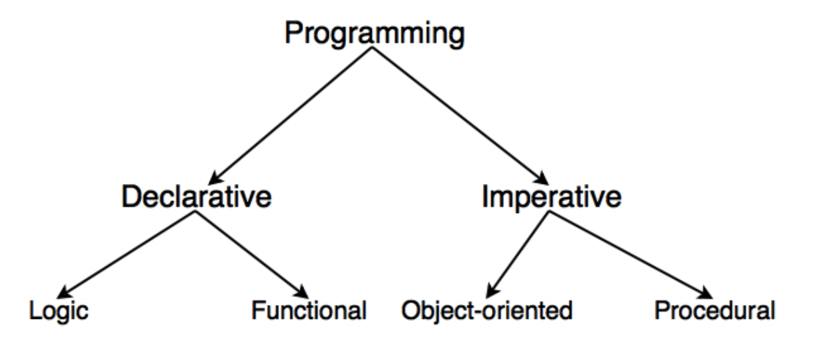

# [CleanArchitecture] Chapter3. 설계원칙

# Overview

## 객체 지향 프로그래밍 (Object-oriented Programming)



<aside>
💡 데이터를 **객체로 추상화**시켜, 객체 내부의 메서드 및 필드를 호출하며 **서로간의 상호작용**을 통해 로직을 구성하는 방법

</aside>

- vs 절차적 프로그래밍 (Procedural Programming)
    - 물이 위에서 아래로 흐르는 것처럼 **순차적인 처리를 중심**으로 코드를 연결하는 프로그래밍 기법

- AOS 부서 소속 Sio가 휴가를 신청하려고 하는데,,

```kotlin
fun main(args: Array<String>) {
	val dayOffs = mutableListOf<Triple<String, String, String>>()
	val name = "Sio"
	val department = "AOS"
	val wantDate = "2023-01-20"

	// 휴가 신청
	dayOffs.add(Triple(name, department, wantDate))
	println("휴가 신청이 완료되었습니다")
}
```

```kotlin
fun main(args: Array<String>) {
	// 객체 정보
	val dayOffService = DayOffService()
	val targetEmployee = Employee(name = "Sio", department = "AOS")

	// 휴가 신청
	dayOffService.registerDayOff(DayOff("2023-01-20", targetEmployee))
}

data class DayOff(
	val date: String,
	val employee: Employee
)

data class Employee(
	val name: String,
	val department: String
)

class DayOffService {
	private val _dayOffs = mutableListOf<DayOff>()
	val dayOffs: List<DayOff>
		get() = _dayOffs

	fun registerDayOff(dayOff: DayOff) {
		  _dayOffs.add(dayOff)
			println("휴가 신청이 완료되었습니다")
	}
}
```

## 객체 (Object)

### object와 class

- 코틀린에서 클래스를 정의하는 키워드는 `class`
    - 코틀린에서 `new` 키워드를 쓰지 않는다는 것은,,
        - `new`가 생겨난 배경을 보면,, C++의  `new`와 `delete`
        - But, Java 및 Kotlin → **메모리 제어의 권한이 프로그래머에게 있지 않다.✨**

- `object` 키워드로 선언하게 되면 **Eager Singleton**으로 구현하는 것과 같다.
    - 클래스가 로드될 때 딱 한번만 생성 (vs **Lazy Singleton**)

### companion object

<aside>
💡 class를 인스턴스화 하지 않아도 접근할 수 있는 방법

</aside>

- `Employee.ofEmpty()`

```kotlin
data class Employee(
	val name: String,
	val deaprtment: String
) {
	companion object {
		private const val DEFAULT_NAME = "new user"
		fun ofEmpty() = Employee(DEFAULT_NAME, "") // name: "new user", deaprtment: ""
	}
}
```

- 클래스 **종속적이지 않은** 메서드 및 프로퍼티 (ex. 클래스 내부 필드가 필요없다.)
- 클래스 인스턴스가 아닌 **클래스와 연결 된** 메서드 및 프로퍼티

인 경우 `companion object` 내에서 선언할 수 있다.

### data class

<aside>
💡 데이터 보관 목적의 클래스

</aside>

```kotlin
data class Employee(
	val name: String,
	val department: String
) {
	companion object {
		fun ofEmpty() = Employee("new user", "")
	}
}

val employee = Employee.ofEmpty() // department: ""
val aosEmployee = employee.copy(deparment = "AOS") // department: "AOS", 무슨 복사일까요?
```

## OOP 특징

### 추상화 (Abstaction)

> *복잡한 데이터 및 시스템으로부터 핵심적인 개념이나 기능을 간추려 내는 것 → 개략화*
> 
- 중요 성질을 추출하여 필드 및 메서드를 정의하기
- 공통 성질을 추출하여 부모 클래스 선정하기

### 캡슐화 (Encapsulation)

> *객체의 속성과 메소드를 하나로 묶고 일부를 외부로부터 감추어 은닉하는 것*
> 

- API Response가 다음과 같이 떨어진다고 해보자

```json
{
	"result": {
		"eid": "k12345678",
		"name": "Sio",
		"day_off_infos": [ // 휴가 정보
			{
				"did": "16687923",
				"period": {
					"start": {
						"date": "2023.01.16"
						"half": true
					},
					"end": {
						"date": "2023.01.19"
						"half": false
					}
				}
			},
			{
				"did": "17825567"
				...
			},
			...
		],
		...
	}
}
```

- 클래스로 추상화 해보자
    - Sio의 휴가 시작 날짜에 접근하기 위해서는 `employee.dayOffInfos.period.start.date` 로 연속적인 체이닝 접근 필요

```kotlin
data class Employee(
	val eid: String,
	val name: String,
	@SerializedName("day_off_infos") val dayOffInfos: List<DayOff>,
	... 
)

**data class DayOff(
	val did: String,
	val period: Period
)**

data class Period(
	val start: Date,
	val end: Date
)

data class Date(
	val date: String,
	val half: Boolean
)
```

- 캡슐화를 적용해본다면?

```kotlin
data class Employee(
	val eid: String,
	val name: String,
	@SerializedName("day_off_infos") val dayOffInfos: List<DayOff>,
	... 
)

**data class DayOff(
	val did: String,
	val period: Period
) {
	val startDate = period.start.date
	val endDate = period.end.date
}**

data class Period(
	val start: Date,
	val end: Date
)

data class Date(
	val date: String,
	val half: Boolean
)
```

- 전/후 비교
    - ✅ DayOff의 내부 구현을 외부로부터 감춘다.
    - ✅ startDate를 사용하는 위치에서는 Date의 내부에 변경이 있어도 영향을 받지 않게한다.

```kotlin
// 캡슐화 적용 전
employee.dayOffInfos.forEach { dayOff ->
	dayOff.period.start.date
}

// 캡슐화 적용 후
employee.dayOffInfos.forEach { dayOff ->
	dayOff.startDate
}
```

- `private`, `immutable` 활용 (backing property)

```kotlin
class DayOffService {
	private val _dayOffs = mutableListOf<Pair<String, Employee>>()
	val dayOffs: List<Pair<String,Employee>>
		get() = _dayOffs

	...
}
```

### 상속 (Inheritance)

> *상위 클래스의 특성을 하위 클래스가 이어받아 재사용하거나 확장 및 추가하는 것*
> 
- 코틀린에서 상속 및 오버라이딩이 가능하려면 `open`

다만 ,,

- 부모가 커진다 → 거대한 BaseXXX 클래스 및 불필요한 함수 존재
- 부모의 변경 → 자식의 변경
- 부모 클래스의 메소드, constraint 등 모든 것을 가져옴

<aside>
💡 객체의 계층 구조를 나타낼 땐 **상속**, 일부만 재사용 하고싶다면 **컴포지션**

</aside>

**컴포지션 (Composition)** ✨

- 우리가 원하는 행위만 가져다 쓰고싶다!

<aside>
💡 객체를 property로 갖고, 함수를 호출하는 형태로 재사용성 ⬆

</aside>

```kotlin
class ElectricCar {
    private val motor = Motor() // 모든 차가 engine을 가지고 있는 것은 아니다.

    fun start() {
        motor.start()
    }
}

fun main(args: Array) {
    val electricCar = ElectricCar()
    electric.start()
}
```

### 다형성 (Polymorphism)

> *하나의 메서드나 클래스가 다양한 방법으로 동작하는 것*
> 

- **오버로딩** - 같은 이름을 가진 메소드를 여러개 두고 메소드 타입, 매개변수 유형 및 개수로 구분
- **오버라이딩** - 상위 클래스로부터 상속받은 메소드를 하위 클래스에서 재정의

**abstract**

> **is kind of** :  상위 클래스의 특성을 자신의 특징에 맞게 재사용 및 확장
> 

**interface**

> **is able to** : 각 클래스의 행위를 명세 및 구현
> 

---

# SOLID

> *5가지 객체지향 설계 원칙*
> 

### 7장. SRP(Single Responsibility) - 단일 책임 원칙

> 하나의 Module은 오직 하나의 Actor만 책임진다 → *하나의 Class / Method는 하나의 책임만을 가져야한다.*
> 

- Employee 클래스는 3개의 액터에 영향을 미친다.
    - calculatePay → CFO (재무 관리자)
    - reportHours() → COO (업무 운영 책임자)
    - saveEmployee() → CTO (기술 경영자)

🌱 서로 다른 액터가 의존하는 코드를 분리한다.

- 3개의 클래스로 나누고, EmployeeData라는 클래스가 공유하도록 한다.
- 단, EmployeeData에서 3가지 클래스를 인스턴스화 하여 가지고 있어야 하고 계속 추적해야 하는데,,


🌱 Facade 패턴!

- Facade → 건물의 정면
- 커다란 코드 시스템(건물 뒷부분)을 간략화된 인터페이스(건물 정면, 출입구)로 제공해주는 디자인 패턴
    - 즉, 하위 시스템을 보다 쉽게 사용할 수 있는 고급 인터페이스

- ex) 클라이언트는 오직 Facade 클래스만 알고있음 → 클라이언트가 서브시스템에 의존하지 않는다.
    - 사용자는 동작 버튼 하나만 누르면 → 세탁, 행굼, 탈수 과정을 자동으로 진행


- SubSystem

```java
public class Wash {

  public Wash() {}

  public void startWash() {
    System.out.println("Start Washing");
  }
}

public class Rinse {

  public Rinse() {}

  public void startRinse() {
    System.out.println("Start Rinsing");
  }
}

public class SpanDry {

  public SpanDry() {}

  public void startDry() {
    System.out.println("Start Drying");
  }
}
```

- Washer (Facade)

```java
public class Washer {
  private final Wash wash;
  private final Rinse rinse;
  private final SpanDry spanDry;

  public Washer() {
    wash = new Wash();
    rinse = new Rinse();
    spanDry = new SpanDry();
  }

  public void start() {
    wash.startWash();
    rinse.startRinse();
    spanDry.startDry();
  }
}
```

### 8장. OCP (Open-Closed) - 개방-폐쇄 원칙

> *유지보수 할 땐 개방하여 쉽게 확장 / 수정할 땐 닫혀 있어야 한다.*
> 

- 아키텍처가 훌륭하다면 변경되는 코드의 양이 최소화 될 것이다.
    - 변경 가능성이 있는 요소를 적절히 분리 (SRP) & 분리한 요소 사이의 의존성을 체계화 (DIP) 해야한다.
    - 적절한 캡슐화 및 은닉화 필요

### 9장. LSP (Liskov Substitution) - 리스코프 치환 원칙

> 부모 클래스의 기능을 무시하지 않고 *하위타입 인스턴스로 치환하여 동작할 수 있어야한다.*
> 

- 정사각형 / 직사각형 문제
    - Square가 Rectangle의 하위 타입으로 적절한가?
        - Rectangle → 높이와 너비가 독립적으로 변경
        - Square → 높이와 너비가 반드시 함께 변경


- 이 코드에서 Square를 생성하면 assert문 실패

```java
Rectangle r = ...
r.setW(5)
r.setH(2)
assert(r.area() == 10);
```

- 집에서 사용하는 다양한 가구를 모델링 → 공통 특성을 만들 수 있을까?
    - interface (abstract)로 만들자

```java
abstract class Furniture {
   open fun getDescription(): String
}

class Chair : **Furniture** {
   override fun getDescription(): String {
      return "일반적인 의자"
   }
}

class RotatingChair : **Furniture** {
   override fun getDescription(): String {
      return "회전하는 의자."
   }

   fun rotate(degrees: Int) {
      // 의자를 회전시키는 코드
   }
}
```

- Furniture 인터페이스를 구현하여 모든 가구를 조작 가능

```java
fun main() {
   val furnitures = mutableListOf<Furniture>()
   furnitures.add(Chair())
   furnitures.add(RotatingChair())

   for (furniture in furnitures) {
      println(furniture.getDescription())
   }
}
```

### 10장. ISP (Interface Segregation) - 인터페이스 분리 원칙

> *하나의 일반적인 인터페이스보다 여러개의 구체적인 인터페이스를 만들어야 한다.*
> 
- 각 클라이언트가 필요로 하는 인터페이스들을 분리하여, 상황에 따라 **한 역할만을 하게 만들기**

- ex) User1은 op1(), User2는 op2(), User3는 op3() 만 사용한다고 가정
    - op2()를 재배포 → User1, User3 까지 다시 재배포해야함


- 적절한 인터페이스로 분리한다.


🌱 불필요한 기능이 많은 것에 의존하지 말아야 한다.

### 11장. DIP (Dependency Inversion) - 의존 역전 원칙

> *상위계층은 하위계층의 변화로부터 독립되어야 한다. (고수준은 저수준에 의존해서는 안되고, 저수준에서 고수준으로의 의존이 이루어져야 한다.)*
> 

- `high level (고수준)` - 집의 형태, 외관, 공간, 방의 배치 (**정책, Policy**) → abstract class, interface
- `low level (저수준)` - 콘센트, 전등의 위치, 지붕의 크기 등의 기초공사 수준 (**세부사항, Detail**) → sub class

- House → LightSwitch, WaterTap에 대한 의존성을 가진다.

```java
class House {
	private val lightSwitch = LightSwitch()
	private val waterTap = WaterTap()

	fun turnOnLightSiwtch() {
		lightSwitch.turnOn() // 전등을 킨다
	}

	fun turnOnWaterTap() {
		waterTap.turnOn() // 수도관을 튼다
	}
}
```

- House 에서의 직접적인 의존을 막는다 → interface를 둠

```java
interface Switch {
   fun turnOn()
   fun turnOff()
}

class LightSwitch : Switch {
   override fun turnOn() {
      // 전등을 켜는 코드
   }
   override fun turnOff() {
      // 전등을 끄는 코드
   }
}

class WaterTap : Switch {
   override fun turnOn() {
      // 수도관에서 물을 얻는 코드
   }
   override fun turnOff() {
      // 수도관에서 물을 끄는 코드
   }
}

class House(private val switch: Switch) {
   fun performAction() {
      switch.turnOn() // 인터페이스를 통해 하부 구현에 의존
      // 다른 작업을 수행하는 코드
      switch.turnOff() // 인터페이스를 통해 하부 구현에 의존
   }
}
```

- 비밀번호 입력값 검증기

```kotlin
// 생년월일 검증 작업 추가 or 아이디 검증 조건 변경?
class Validator {
		fun validateId(id: String) {
				// 영문과 숫자조합
				// 8자 이상
				// ...
		}
		
		fun validateNickname(nickname: String) {
				// 숫자 들어가면 안됨
				// 8자 이하
		}
}

// 하나의 책임만을 가지기?
class IdValidator {
		fun validateId(id: String) {
				// 영문과 숫자조합
				// 8자 이상
				// ...
		}
}
```

- **빈번한 코드 수정 → 유지보수가 힘들다**

- 리팩토링 ‼️

```kotlin
/**
* validator 인터페이스로 확장,
* policy로 변화에 대응하자
**/

interface Validator {
	fun validate(target: String)
}

class IdValidator(policy: IdPolicy): Validator {
	override fun validate(target: String) {
        // 영문과 숫자 조합
				// 8자 이상
  }
}

class BirthdayValidator(pocicy: BirthdayPolicy): Validator {
	override fun validate(target: String) {
        // 1920년 이상
				// 1-12월만
  }
}
```

- validator 조합

```kotlin

object ValidatorModule {
	val validators = mutableListOf<Validator>()
	
	fun createSignUpValidator() {
		validators.apply {
			add (
				IdValidator(
					IdPolicy(
						isAlphabetRequired = true,
            isNumericRequired = true,
						minimumLength = 8
					)
				)
			),

			add (
				BirthdayValidator(
					BirthdayPolicy(minimumYear = 1920)
				)
			)
			...
		}

		return InputValidatior(validators)
	}
}
```

- 실제로 접근하는 클래스

```kotlin
class InputValidator(private val validators: List<Validator>) {
	fun validate(target: String) {
		validators.forEach {
				// 모든 유효성 처리
		}
	}
}

// Error 유형
enum class ValidationError {
	ALPHABET_REQUIRED,
	NUMERIC_REQUIRED,
	LENGTH_VIOLATED,
	...
}
```
