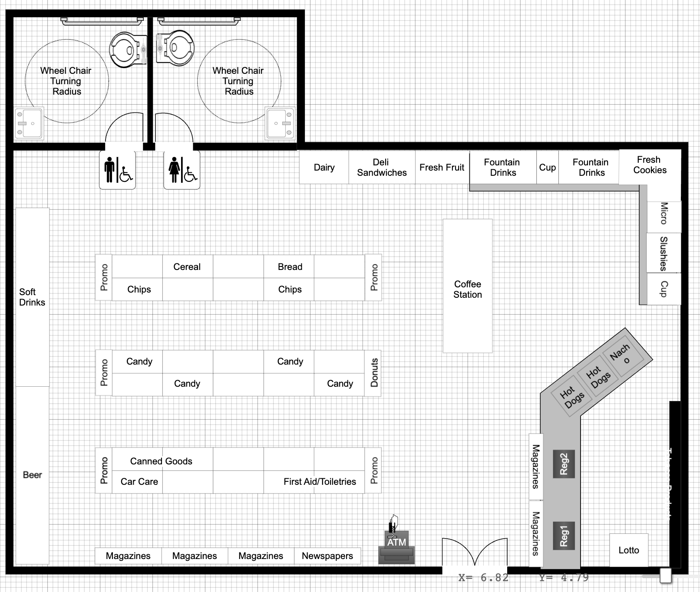
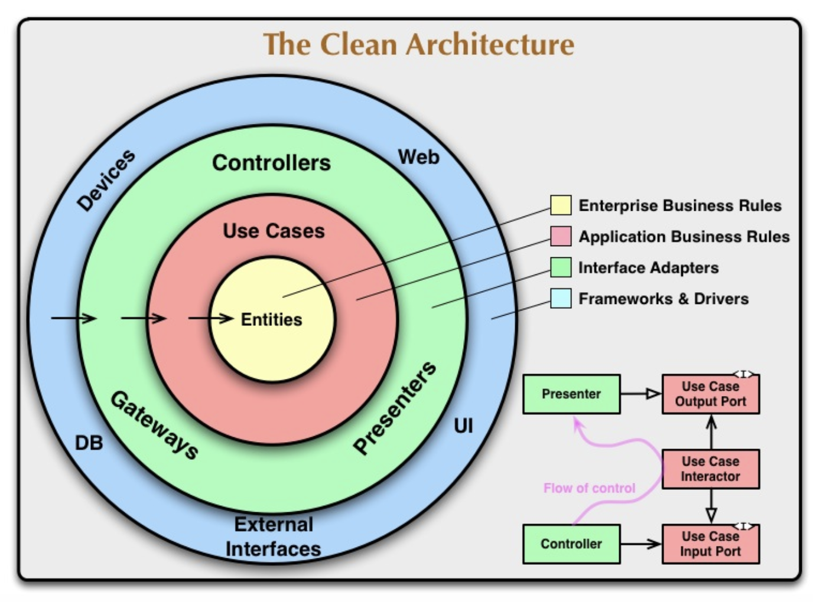
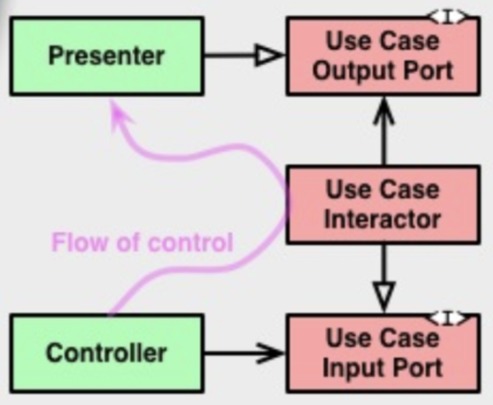

# 목차

- 21장. 소리치는 아키텍처 - 아키텍처는 유스케이스를 나타내야 한다. 프레임워크가 아니라.
- 22장. 클린 아키텍처 - 계층 분리를 통한 관심사 분리로 변경 영향 막기. 의존성 규칙 지키기. (안쪽은 바깥쪽을 모른다)
- 23장. 프레젠터와 험블 객체 - 아키텍처 경계에서 험블 객체 패턴을 통해 테스트하기 어려운 것 분리하기.

# 21장. 소리치는 아키텍처

## 아키텍처를 딱 보면...

다음과 같이 어떤 건물의 아키텍처를 본다고 생각해보자.



설계도를 보면 바로 이 아키텍처는 "편의점이야"라고 소리치고 있다.

그럼 여러분의 **애플리케이션을 보면** 아키텍처는 뭐라고 소리치는가? "재고 관리 시스템이야" 아니면 "스프링이야"?

- 상위 수준의 디렉터리나 최상위 패키지의 소스파일을 보면

## 유스케이스가 중심

소프트웨어 아키텍처는 결국 시스템의 유스케이스를 지원하기 위한 구조.

따라서 애플리케이션의 아키텍처도 애플리케이션의 유스케이스에 대해 소리쳐야 한다.

절대로 프레임워크에 대한 것이 아니다. 

## 세부사항들

건물 아키텍처는 결국 각 공간이 잘 배치됐는지(과자와 사탕의 위치가 알맞은지..)가 먼저. 선반을 무슨 색으로 할지가 더 중요한 것이 아니다.

소프트웨어 아키텍처도 결국 프레임워크, 데이터베이스, 웹서버, 전달 방식(콘솔 앱, 웹 앱)등은 나중으로 분리할 수 있어야 한다.

## 테스트하기 쉬운 아키텍처

어떻게 하면 프레임워크가 아키텍처의 중심을 차지하는 일을 막고, 유스케이스에 중점을 둘 수 있을 지 생각해봐라. 

즉, **프레임워크를 준비하지 않더라도 필요한 유스케이스 전부에 대해 단위 테스트**를 할 수 있어야 한다.

- 웹서버가 필요하거나, 데이터베이스가 있어야 하거나 X

엔티티 객체는 반드시 plain old object. (POJO → 순수한 자바 객체) 엔티티 객체가 기타 다른 것에 의존하면 안된다.

## 결론

- 프로젝트에 대해 모르는 사람도 당신의 소스 저장소를 보고 어떤 저장소인지 한 눈에 알 수 있어야함
- 웹서비스인지 몰라도 모든 유스케이스를 이해할 수 있어야함.
  - 즉, 뷰와 컨트롤러가 어딨는지 몰라도 이해할 수 있어야함

# 22장. 클린 아키텍처

## 관심사의 분리

이때까지 있던 여러 아키텍처 아이디어들 → 공통적인 건 '관심사의 분리'

**모두 소프트웨어를 계층으로 분리하여 관심사의 분리라는 목표 달성**

### 장점

- 프레임워크 독립성: 프레임워크는 도구일 뿐. 끌려가지 않음
- 테스트 용이성
- UI 독립성
- 데이터베이스 독립성
- 외부 에이전시에 대한 독립성

독립성 → 알지 못함 & 변경되도 영향 없음

### 다이어그램

이런 아키텍처를 다이어그램으로 나타내면 아래와 같다.



- 출처 : http://blog.cleancoder.com/uncle-bob/2012/08/13/the-clean-architecture.html

모든 아키텍처와 이와 같진 않을 수 있다. 하지만 공통적인 목표는 계층 분리를 통한 관심사 분리, 그리고 **의존성 규칙**을 지키는 것이다.

1. 엔티티: 핵심 업무 규칙 캡슐화. 애플리케이션에 무언가 변경이 필요하더라도 영향X
2. 유스케이스: 엔티티로 들어오고 나가는 데이터 흐름 조정. 엔티티가 자신의 핵심 업무 규칙을 사용해서 유스케이스의 목적 달성하도록 이끔.
3. 인터페이스 어댑터: 데이터를 유스케이스&엔티티에게 가장 편리한 형식 → 데이터베이스나 웹같은 외부에게 가장 편리한 형식으로 변환 / 은 외부에서 내부적인 형식으로 변환
   - 예) GUI의 MVC 아키텍처 모두 포괄. 즉 프레젠터, 뷰, 컨트롤러 모두 포함. 모델은 데이터 구조. 모델이 컨트롤러 → 유스케이스로 전달되고, 다시 유스케이스에서 프레젠터와 뷰로 되돌아감
4. 프레임워크와 드라이버: 모두 세부사항들!

## 의존성 규칙

일단 다이어그램에서 고수준과 저수준의 구분을 먼저 해보자.

| ⬆️    | 고수준. 안쪽. 추상화 수준 높음   |
| ---- | -------------------------------- |
| ⬇️    | 저수준. 바깥쪽. 추상화 수준 낮음 |

소스코드 의존성은 고수준으로. 즉 안쪽에선 바깥쪽을 모른다.

- 모른다? 바깥쪽에서 어떤 함수, 클래스, 데이터 구조를 사용하든 이름을 모른다. **외부에서 사용하는 데이터 구조**도 역시 몰라야 한다.
  - 즉 데이터베이스 행을 그대로 안으로 전달하거나.. X

그래야 고수준이 변경의 영향을 받지 않는다.

## 경계 횡단하기




제어흐름과 달리 각 **의존성은 유스케이스를 향해 안쪽**을 가리킨다. → **의존성 규칙** 지킴

이렇게 의존성 규칙을 지키기 위해 의존성 역전 원칙을 사용할 수 있다.

### 경계를 횡단하는 데이터

이 때 경계를 가로지를 때 데이터가 전달될 것이다. 이 때 데이터는 간단한 구조로, DTO(Data Transfer Object)가 있다. 혹은 함수 호출시 간단한 인자를 사용해서 전달할 수도 있다. 

어쨌든 중요한 건 '격리된' 데이터 구조가 경계를 가로질러 전달된다는 것. 즉, 데이터베이스 행을 직접 전달하거나 X → 데이터베이스 구조에 의존하게 되면서 '알게'됨

따라서 경계를 가로질러 데이터를 전달할 때, 데이터는 항상 **내부의 원에서 사용하기에 가장 편리한 형태**를 가져야만 한다.

### 의존성 규칙을 지키기 위한 예시

참고: [우아한기술블로그 - 주니어 개발자의 클린 아키텍처 맛보기](https://techblog.woowahan.com/2647/)

- Entity의 DTO 직접 참조

  ```java
  public class Entity {
      ...
      public static Entity of(Request request) {
          ...
      }
  }
  ```

  - 이 의미는, DTO가 변경될 때 Entity도 변경될 수 있다는 것이다.
  - 따라서 Entity를 생성하는 유스케이스 계층에서 DTO의 데이터를 꺼내서 Entity를 생성하는 것이 변경의 영향을 받지 않는다.

나머지는 한 번 읽어보세요!

## 결론

소프트웨어를 계층으로 분리 & 의존성 규칙 준수 → 테스트하기 쉬운 시스템, 외부 요소의 쉬운 교체

# 23장. 프레젠터와 험블 객체

위 다이어그램에서 프레젠터는 '험블 객체'이다. 그리고 아키텍처는 험블 객체들로 가득 차 있다.

## 험블 객체 패턴

험블 객체 패턴은 디자인 패턴으로, 이 패턴을 통해 단위테스트를 보다 쉽게 할 수 있다.

험블 객체 패턴은 어떤 행위를 두 개의 모듈/클래스로 나누는 것.

1. 험블 객체: 테스트하기 어려운 걸 모아둠. 아주 단순한 행위만 함
2. 나머지: 테스트하기 쉬운 것들 모아둠

예를 보면 쉽다.

### 프레젠터와 뷰

뷰는 험블 객체로 테스트하기 어렵다. 이 객체의 코드는 최대한 간단하게 유지한다.

프레젠터는 테스트하기 쉽다. 프레젠터의 역할은 **애플리케이션으로부터 데이터를 받아 화면에 표현할 수 있는 포맷으로 만드는 것**이다.

그리고 뷰는 그걸 넘겨받아 **화면에 로드만** 하면 된다.

- 애플리케이션에서 어떤 필드에 날짜를 표시하고 싶다면
  - 애플리케이션 → 프레젠터: `Date` 객체 전달
  - 프레젠터: 해당 객체를 출력할 적절한 포맷의 문자열로 만들고 뷰 모델이라고 부르는 간단한 데이터 구조에 담음
  - 뷰: 뷰 모델에서 데이터를 찾고 보여주기만 하면 됨

### 데이터베이스 게이트웨이

- 유스케이스 인터랙터와 데이터베이스 사이에 있는 인터페이스
- 게이트웨이는 애플리케이션이 데이터베이스에 수행하는 CRUD 작업과 관련된 모든 메서드 포함.
- 게이트웨이는 험블 객체로 테스트하기 어렵지만, 유스케이스 인터랙터는 테스트하기 쉬움 → 게이트웨이는 스텁이나 테스트 더블로 교체 가능

## 결론

아키텍처 경계를 넘나들 땐 모두 간단한 데이터를 수반한다. 그리고 그 경계는 테스트하기 쉬운/어려운 것으로 분리 가능. → 테스트 용이성 높아짐!


