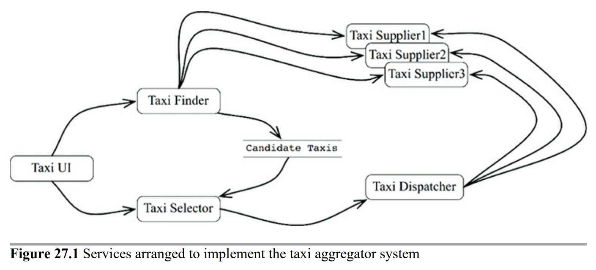

# 5부 아키텍처

# 27장 ‘크고 작은 모든’ 서비스들

## 서비스 아키텍처

SOA든 MSA든 서비스 단위로 시스템을 구성한다고 하더라도 서비스 자체는 아키텍처가 아니다. 시스템의 아키텍처는 의존성 규칙을 준수하며 고수준 정책과 저수준 세부사항을 분리하는 경계에 의해 결정되는 것이기 때문이다. 

기능(행위) 단위로 나뉜 ‘서비스’ 자체는 조금 비싼 함수 호출이며 아키텍처 관점에서 중요한것은 아니다. 

> c.f. 서비스는 서로 다른 프로세스, 혹은 다른 서버로 분산되어 실행된다. 단일 시스템의 함수 호출보다 느리고 실패할 위험성이 있으며 데이터 정합성 유지도 어렵다.
> 

## 서비스의 이점?

### 결합 분리 오류

시스템을 작은 서비스로 분리하면 시스템의 결합이 분리된다고 기대한다. 

그러나 서비스 내부의 변수 수준이 아닌 서비스간의 통신에 의해 결합될 가능성이 있다. 

### 개발 및 배포 독립성 오류

서비스를 사용하면 전담팀이 서비스를 개발, 배포, 유지보수, 운영하며 scalability도 지킬 수 있다고 기대한다. 

그러나 확장 가능한 시스템 개발은 기존의 모놀리틱 시스템으로도 구축할 수 있다. 또한 결합 분리 오류에서 보았듯 데이터가 결합되어 있다면 개발 배포, 운영에도 결합이 생긴다.

## 야옹이 문제

다음과 같은 마이크로서비스 기반의 택시 통합 시스템이 있다고 가정해보자.

TaxiFinder 서비스는 TaxiSupplier 현황을 검토하여 적합한 택시 후보를 선별하고 보여준다. TaxiSelector 서비스는 사용자가 지정한 조건을 기반으로 적합한 택시를 선택한다. TaxiDispatcher는 배정된 택시에 배차 지시를 내린다. 

기능 개발과 배포, 유지보수, 운영이 서비스 단위로 이루어지며 새로운 기능이 추가되더라도 기존 서비스에 영향을 미치지 않을 것 처럼 보인다.

정말 그럴까?

사용자에게 야옹이를 배달해야 하는 새로운 기능이 추가된다면 어떨까? 야옹이 배달 주문이 도착하면 근처 택시가 선별되도 승차 지점에서 야옹이를 태워 목적지에 배달해야 한다. 그런데 기존 택시 배차 계약이 체결된 택시 회사중 일부는 새로운 야옹이 배달 사업에 참가하지 않고 또 어떤 회사는 야옹이 배달 사업에만 참가하는 상황이 생겼다. 또 어떤 택시기사나 승객은 고양이 알러지가 있는 등 복잡한 요건이 더해진다고 생각해보자.

결국 이 기능 구현을 위해서는 기존 시스템의 상당수에 변경이 가해진다. 마이크로서비스 기반으로 시스템을 구축하였더라도 새로운 기능이 **횡단 관심사 (Cross - Cutting Concern)** 를 가진다면 독립적인 개발, 배포, 유지보수, 운영은 불가능하다.

## 객체가 구출하다.

마이크로서비스가 아닌 기존의 컴포넌트 기반 아키텍처라고 생각하고 이 문제를 해결한다면 아래와 같은 방법을 생각해 볼 수 있다. 다형적으로 확장 가능한 클래스를 만들어 새로운 기능을 처리하도록 만든다.

기존의 택시 배차 특화 로직은 Rides 컴포넌트에, 야옹이 배달 특화 신규 기능은 Kittens 컴포넌트에 배치되었다. 야옹이 배달 기능 추가로 인해 TaxiUI는 변경되어야 하겠지만 나머지 클래스는 변경이 필요하지 않다. 따라서 야옹이 기능은 결합이 분리되며 독립적인 개발 배포가 가능하다.

## 컴포넌트 기반 서비스

모놀리틱 시스템이 아닌 마이크로서비스에서도 이 전략을 사용할 수 있다. 서비스는 SOLID 원칙대로 설계할 수 있고 컴포넌트 구조를 갖출 수도 있다. 자바 기준에서 서비스는 하나(또는 그 이상)의 jar 파일에 포함되는 추상 클래스의 집합으로 볼 수 있다. 기능을 추가하고 싶으면 기존 jar의 추상 클래스를 확장하여 새로운 jar 파일에 구현하여 만든다. 이러면 기존 서비스를 재배포하지 않고 OCP를 준수하여 개발할 수 있다.

## 결론

아키텍처의 경계는 서비스 사이에 있는것이 아니다. 서비스를 관통하여 컴포넌트 단위로 분할한것이 아키텍처가 된다. 서비스의 내부는 의존성 규칙을 준수하는 컴포넌트 아키텍처로 설계해야 한다. 

시스템 아키텍처는 시스템의 구성 요소 (서비스 단위)가 통신, 실행하는 물리적인 메커니즘이 **아니라** 시스템 내부에 그어진 경계와 의존성에 의해 정의된다. 

# 28장 테스트 경계

## 시스템 컴포넌트인 테스트

어떤 테스트이든 (e.x. 단위테스트, 통합테스트, 인수테스트, TDD테스트 …) 테스트는 시스템의 일부이며 시스템 아키텍처에도 관여한다. 테스트는 그 목적이 오류를 탐지하는 것이기 때문에 태생적으로 의존성 규칙을 따른다. 테스트는 세부적이며 구체적이기 때문에 테스트 대상 코드를 향해 의존성이 발생한다. 22장에서 살펴본 원형으로 표현한 클린 아키텍처에서 가장 바깥쪽 원에 속한다.

**c.f. 클린 아키텍처**

테스트는 시스템의 모든 컴포넌트 중에서 가장 고립되어 있다. 테스트 자체는 시스템 운영에 어떤 필요도 없고 어떤 사용자도 테스트 코드에 의존하여 기능을 수행하지 않기 때문이다. 그럼에도 테스트는 시스템의 한 컴포넌트이다.

## 테스트를 고려한 설계

개발자는 종종 테스트가 시스템 설계의 범위 밖에 있다고 여기는 치명적인 실수를 저지른다. 시스템 설계에서 테스트에 대한 고려가 빠지면 테스트는 깨지기 쉬워지고 시스템은 뻣뻣해져 결국 변경이 어려운 시스템이 되어버린다. 

문제는 테스트가 시스템에 강하게 결합되어 있을 때 발생한다. 시스템의 다른 컴포넌트에서 생긴 변경에 의해 이와 결합된 수많은 테스트가 실패하게 된다. → 깨지기 쉬운 테스트 문제

깨지기 쉬운 테스트는 시스템을 뻣뻣하게 만든다. 시스템에 간단한 변경을 가했을 뿐인데 수십, 수백개의 테스트 코드가 깨질 것을 개발자가 알고 있다면 변경에 보수적이게 될 수 밖에 없다. 

### c.f. 깨지기 쉬운 테스트 문제

좋은 단위테스트를 위한 4대 요소가 있다 - from. *단위 테스트* 

1. **회귀 방지**: 테스트 코드의 커버리지가 높은가?
2. **리팩터링 내성**: 거짓 양성의 수가 적은가?
3. **빠른 피드백**: 테스트 코드가 빠르게 실행되는가?
4. **유지보수성**: 테스트 코드가 읽기 쉽고 실행하기 쉬운가?

이 중 리팩터링 내성이 낮은 테스트 코드를 깨지기 쉬운 테스트라고 한다.

리팩터링 내성은 기존 테스트 코드를 변경하지 않고 어플리케이션을 리팩터링할 수 있는지를 나타내는 척도이다. 리팩터링 내성이 낮다면 실제로 리팩터링으로 인한 기능상 오류가 없음에도 테스트 코드가 실패하게 된다. 이를 **거짓 양성 (false positive)** 이라고 한다. 기능에는 문제가 없는데 테스트가 실패하니 일종의 허위 경보라고도 볼 수 있다. 

거짓 양성이 자주 발생하면 테스트의 지속 가능성이 낮아진다. 타당한 이유 없이 실패하기 때문에 테스트 실패를 무시하게 되며 테스트 suite에 대한 개발자의 신뢰가 떨어진다.

## 테스트 API

테스트가 모든 업무 규칙을 검증할 수 있는 특화된 테스트 API를 만들어라. 테스트 API는 테스트의 구조를 어플리케이션의 구조에서 분리시킬 수 있도록 해준다.

### 구조적 결합

모든 상용 클래스 각각에 테스트 클래스가 존재하고, 모든 상용 메서드에는 테스트 메서드 셋이 존재하는 테스트 suite이 있다고 가정해보자. 이런 테스트 구조는 어플리케이션 구조에 강결합 된 형태이다. 상용 클래스/메서드가 변경되면 딸려있는 다수의 테스트도 변경되어야 한다. 테스트는 깨지기 쉬워지고 결과적으로 시스템의 상용 코드가 뻣뻣해진다.

테스트 API를 적용하면 어플리케이션의 내부 구조를 테스트 코드로부터 숨길 수 있다. 이렇게 되면 어플리케이션 코드를 변경하더라도 테스트에는 영향을 주지 않는다. _(반대의 경우도 마찬가지이다.)_

## 결론

테스트는 시스템의 일부이다. 테스트에 기대하는 이점을 얻기 위해서는 시스템 설계 단계에서부터 테스트를 시스템의 일부로 고려해야 한다. 그렇지 않으면 테스트는 깨지기 쉽고 시스템은 뻣뻣해져 변경과 유지보수가 어려워진다.