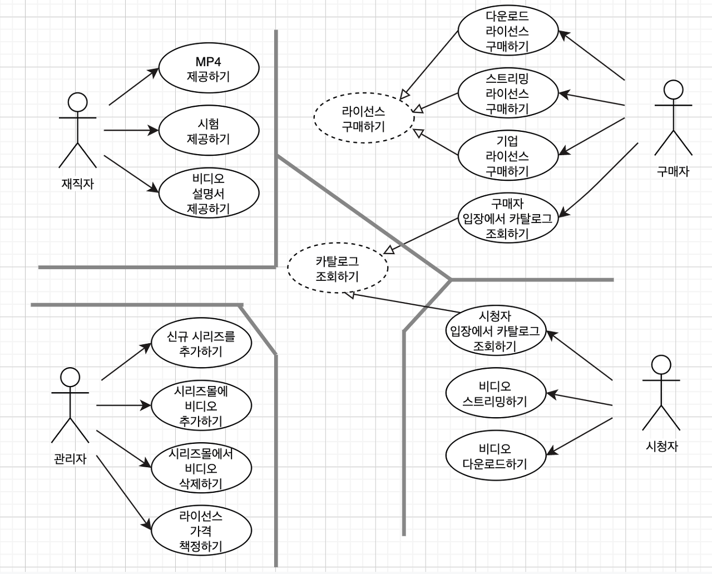

# [클린아키텍처] 6. 세부사항

---

# 33장. 사례 연구: 비디오 판매

## 제품

제품은 웹 사이트에서 비디오를 판매하는 소프트웨어다

시스템의 초기 아키텍처를 결정하는 첫 단계는 액터와 유스케이스를 식별하는 일이다

## 유스케이스 분석

재직자, 구매자, 관리자, 시청자라는 네 개의 액터

단일 책임 원칙에 따르면 이 네 액터가 시스템이 변경되어야 할 네 가지 주요 근원이 된다

기능 추가, 변경은 액터에게 기능을 제공 하기 위해서다

특정 액터를 위한 변경은 다른 액터에게 영향을 끼치지 않아야 한다

카탈로그 조회하기와 라이선스 구매하기는 추상 유스케이스이다

다른 유스케이스에서 이를 구체화한다

카탈로그 조회하기 → 구매자 입장에서 카탈로그 조회하기, 시청자 입장에서 카탈로그 조회하기

## 컴포넌트 아키텍처

이중 선이 아키텍처의 경계이다

View, Presenter, Interactor, Controller로 분리하고 대응하는 액터 별로 컴포넌트를 분리한다

Catalog View와 Catalog Presenter는 추상 유스케이스이다

해당 컴포넌트 내부에서 추상 클래스로 코드화 되어서 상속받는 컴포넌트에서는 상속받은 뷰와 프레젠터 클래스를 포함한다

이러한 컴포넌트를 모두 분할해서 여러 .jar 파일로 전달해야 할까

각 컴포넌트를 독립적으로 컴파일하고 빌드할 수 있는 환경을 구성하면 시스템이 변화하는것에 맞춰서 배포 방식을 조정할 수 있다

## 의존성 관리

컴포넌트 아키텍처 다이어그램에서 제어흐름은 오른쪽에서 왼쪽으로 이동한다 (의존성 규칙)

입력이 컨트롤러에서 발생하면 인터랙터에서 처리되어 결과가 만들어지고 프레젠터가 결과의 포맷을 변경하고 뷰가 화면에 표시한다

하지만 모든 제어흐름이 오른쪽에서 왼쪽으로 흐르진 않는다

그래도 모든 의존성은 경계선을 한 방향으로만 가로지르는데 항상 더 높은 수준의 정책을 포함하는 컴포넌트를 향한다

열린 화살표(사용 관계)는 제어 흐름과 같은 방향을, 닫힌 화살표(상속 관계)는 제어 흐름과 반대 방향을 가리킨다

개방 폐쇄 원칙

의존성이 올바른 방향으로 흐르며 저수준의 세부사항에서 발생한 변경이 상위로 파급되어 상위 수준의 정책에 영향을 끼치지 않음을 보장

## 결론

아키텍처 다이어그램에서 두 가지 서로 다른 차원의 분리 개념을 포함하고 있다

하나는 단일 책임 원칙에 기반한 액터의 분리이고, 다른 하나는 의존성 규칙이다

이 두 개념은 모두 서로 다른 이유로, 서로 다른 속도로 변경되는 컴포넌트를 분리한다

이런 방식으로 구조화하고 나면 상황에 맞게 배포 방식을 선택할 수 있다

# 34장. 빠져 있는 장

## 개요

이제 올바르게 정의된 경계, 명확한 책임, 통제된 의존성을 가진 클래스와 컴포넌트로 구성된 소프트웨어를 설계할 수 있다

하지만 구현 세부사항 또한 고려해야 한다

예시로 온라인 서점에서 고객이 주문 장태를 조회할 수 있어야 한다는 유스케이스를 구현해야 한다고 해보자

## 계층 기반 패키지

가장 단순한 설계 방식은 수평 계층 아키텍처다

웹, 업무 규칙, 영속성을 위한 계층이 하나씩 존재

엄격한 계층형 아키텍처에선 반드시 바로 아래 계층에만 의존

쉬우나 모든 코드를 3개에 담기엔 부족할 수 있고, 업무 도메인에 대해 알기 어렵다

## 기능 기반 패키지

서로 연관된 기능에 기반하여 수직으로 코드를 나누는 방식

이전 계층 기반 패키지에서의 모든 타입이 기능을 반영한 이름의 하나의 자바 패키지에 속함

업무 도메인에 대해 알기 쉽다, 찾기 쉽다

## 포트와 어댑터

업무, 도메인에 초점을 둔 코드와 프레임워크 데이터베이스 같은 기술적인 세부 구현과 독립적이면 분리된 아키텍처를 만듦

내부(도메인)과 외부(인프라)로 나눔

외부가 내부에 의존하고 내부가 외부에 의존해서는 안된다

## 컴포넌트 기반 패키지

계층형 아키텍처의 목적은 기능이 같은 코드끼리 서로 분리하는 것이다

웹 관련 코드와 업무 로직을 분리하고, 업무 로직은 데이터 접근과 분리한다

이렇게 되면 서로 다른 패키지의 클래스들끼리 의존해야 하므로 public이어야 한다

모든 클래스들에서 접근할 수 있으므로 계층을 건너뛰는 일이 발생할 수 있다

하지만 이 것은 CQRS 패턴을 지킬 때 빼고는 바람직하지 않다

따라서 컴포넌트 기반 패키지를 도입해야 한다

큰 단위의 단일 컴포넌트와 관련된 모든 책임을 하나의 자바 패키지로 묶는다

마이크로 서비스 아키텍처처럼 서비스 중심적인 시각으로 소프트웨어 시스템을 바라본다

사용자 인터페이스를 큰 단위의 컴포넌트로부터 분리해서 유지

## 구현 세부사항엔 항상 문제가 있다

public 지시자는 캡슐화의 이점을 활용하지 않겠다는 것이다

## 조직화 vs 캡슐화

모두 public으로 만든다면 패키지는 그저 조직화에만 사용될 뿐, 캡슐화와 은닉은 도움이 되지 않고 아키텍처 접근법도 의미가 없어진다

## 다른 결합 분리 모드

업무와 도메인용 , 웹용, 데이터 영속성용 소스 코드 트리를 만들어 의존성을 분리한다

업무와 도메인용과 다른 두 코드트리는 컴파일 시점에 의존성을 가지고, 업무와 도메인 코드 트리는 다른 코드 트리에 대해 알지 못한다

빌드 도구를 활용하여 할 수 있지만 성능, 복잡성, 유지보수 문제가 생긴다

다른 방법으로는 도메인 코드(내부)와 인프라 코드(외부)로 나눌 수 있다

하지만 이 방법에서는 외부 코드에서 내부를 거치지 않고 바로 의존해버릴 수 있다는 단점이 있다.